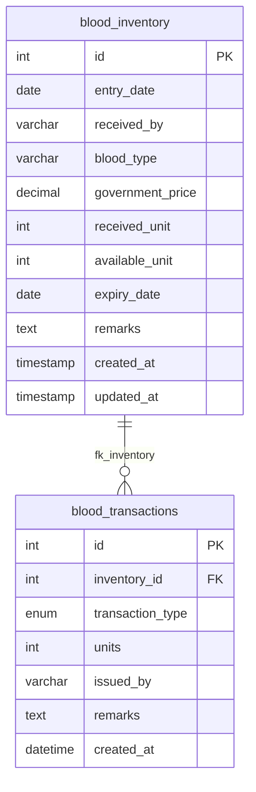

# Database Analysis Report: Blood Bank Inventory Schema

We have analyzed the Dump.sql file containing the structure of the `blood_bank_db` database. Below is a detailed breakdown of the schema, relationships, indexes, and constraints.

---

## 📊 Database Overview
- **Database Engine**: InnoDB (supports ACID transactions and foreign keys)
- **Character Set**: `utf8mb4` with `utf8mb4_0900_ai_ci` collation (supports full Unicode/emojis)
- **Total Tables**: 2

---

## 🔑 Entity-Relationship Diagram (ERD)

---

## 📋 Table Definitions

### 1. `blood_inventory`
This table acts as the master registry for incoming blood packages (batches). It tracks the quantity of blood units received, their origin/operator, prices, and available stock units.

| Column Name | Data Type | Modifiers | Description |
| :--- | :--- | :--- | :--- |
| **`id`** | `int` | `NOT NULL AUTO_INCREMENT` | Primary Key uniquely identifying each blood batch. |
| **`entry_date`** | `date` | `NOT NULL` | The collection date when the blood bag was added. |
| **`received_by`** | `varchar(100)` | `NOT NULL` | Name of the staff/origin center who added the stock. |
| **`blood_type`** | `varchar(5)` | `NOT NULL` | Blood group (e.g. "A+", "O-"). |
| **`government_price`**| `decimal(10,2)`| `NOT NULL` | Standard price per unit in decimal format. |
| **`received_unit`** | `int` | `NOT NULL` | Original quantity of bags received in the batch. |
| **`available_unit`** | `int` | `NOT NULL DEFAULT '0'` | Current stock count remaining in the batch. |
| **`expiry_date`** | `date` | `NOT NULL` | Expiry timeline threshold date of the blood units. |
| **`remarks`** | `text` | `NULL` | Optional comments/notes. |
| **`created_at`** | `timestamp` | `DEFAULT CURRENT_TIMESTAMP` | System record insertion timestamp. |
| **`updated_at`** | `timestamp` | `DEFAULT CURRENT_TIMESTAMP ON UPDATE CURRENT_TIMESTAMP` | System record modification automatic timestamp. |

#### Constraints & Rules:
- **Primary Key**: `PRIMARY KEY (id)`
- **Check Constraint**: `chk_received_unit` ensures `received_unit > 0` (can never enter zero or negative units on entry).

---

### 2. `blood_transactions`
This table logs audit events for stock movements (either adding new bags to stock or issuing units out of stock).

| Column Name | Data Type | Modifiers | Description |
| :--- | :--- | :--- | :--- |
| **`id`** | `int` | `NOT NULL AUTO_INCREMENT` | Primary Key for each transaction audit log. |
| **`inventory_id`** | `int` | `NOT NULL` | Foreign Key targeting `blood_inventory(id)`. |
| **`transaction_type`**| `enum('RECEIVE','ISSUE')` | `NOT NULL` | Type of stock operation. |
| **`units`** | `int` | `NOT NULL` | Number of bags affected in this transaction. |
| **`issued_by`** | `varchar(100)` | `NOT NULL` | Name of the operator/organization who authorized the action. |
| **`remarks`** | `text` | `NULL` | Purpose of transaction (e.g. patient name, location). |
| **`created_at`** | `datetime` | `DEFAULT CURRENT_TIMESTAMP` | Log timestamp. |

#### Constraints & Relationships:
- **Primary Key**: `PRIMARY KEY (id)`
- **Foreign Key Index**: `KEY fk_inventory (inventory_id)` for optimized joins.
- **Foreign Key constraint**: `fk_inventory`
  - Targets: `blood_inventory(id)`
  - **`ON DELETE RESTRICT`**: Prevents deleting a blood inventory record if there are associated transaction logs (ensures historical integrity).
  - **`ON UPDATE CASCADE`**: If an inventory ID changes, transaction logs update automatically.

---

## 💡 Key Design Observations

1. **Transactional Safety**: The schema correctly utilizes InnoDB. Foreign key deletes are restricted (`ON DELETE RESTRICT`), which prevents accidental deletion of active inventory batches that have past audit trails.
2. **Batch Availability Tracking**: The `available_unit` in the inventory table allows the backend to perform fast stock availability queries (rather than scanning all transaction histories).
3. **Optimizations**:
   - `blood_type` uses `varchar(5)`, which is plenty of space for standard types like `A+`, `AB-`, etc.
   - An index exists on `inventory_id` in `blood_transactions` which speeds up JOIN queries (such as the transaction history audit dashboard).
